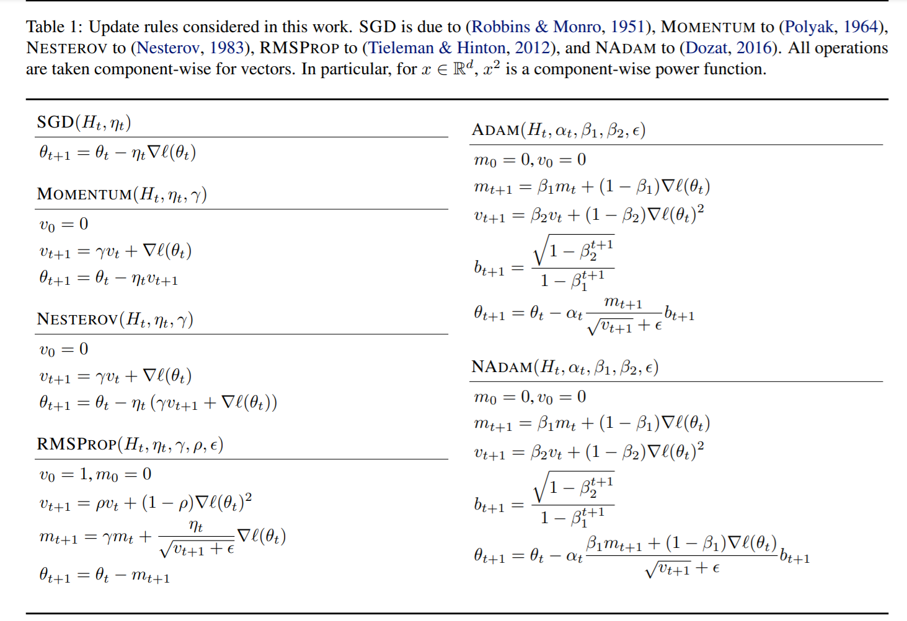
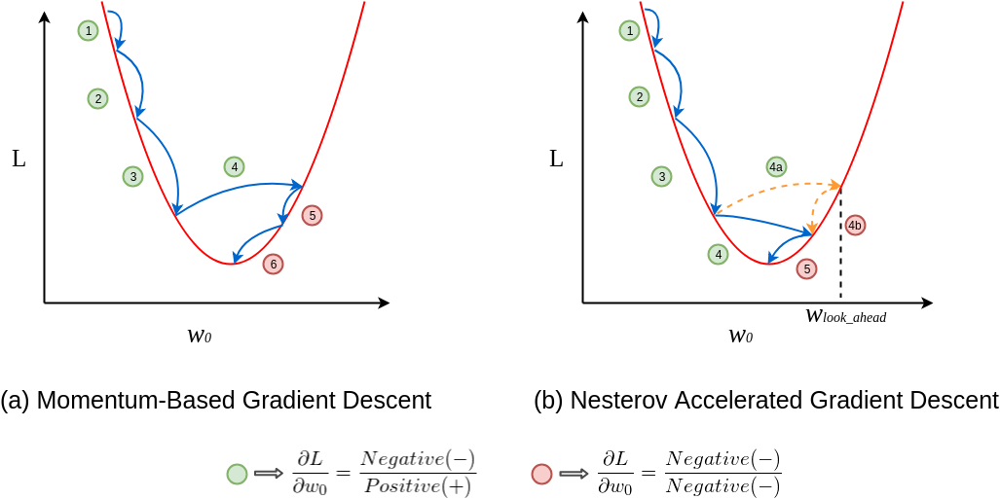
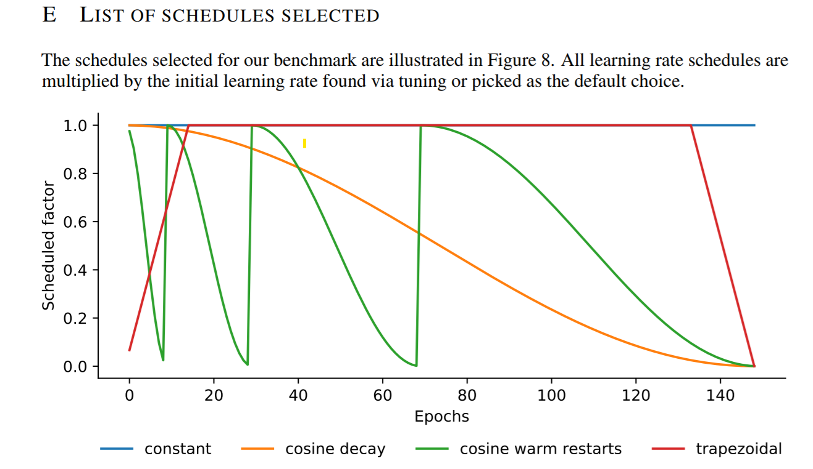

Notes from the following papers:

1. [An overview of gradient descent optimization algorithms](https://arxiv.org/pdf/1609.04747.pdf)
2. [On Empirical Comparisons of Optimizers for Deep Learning](https://arxiv.org/pdf/1910.05446.pdf)
3. [DESCENDING THROUGH A CROWDED VALLEY](https://arxiv.org/pdf/2007.01547.pdf)

List of algorithms considered beyond plain SGD:
1. SGD + momentum (Nesterov, Polyak)
1. ADAM
3. RMSProp
4. NAdam, Adagrad, AdaDelta?

<!--  -->

<!-- ## Related questions -->
<!-- 1. Where does momentum really help? Just lightly sloped surfaces? -->
<!-- 2. Why do gradient normalization per weight? -->
<!-- 4. Is paper 2s nesterov expression correct? -->

# Quick intro to each algorithm

<!-- For some quantity $a, a^\prime, a^{\prime\prime}$ denote the value at two consecutive times steps, e.g. $t+1, t+2$, respectively. -->

Use notation $g_t = \nabla_\theta L(\theta_t)$

## Momentum

$$ \Large m_t = \gamma m_{t-1} + \eta g_t $$

Use $\theta_{t+1} = \theta_t - m_t$ as step in parameter space.

**Hyperparams**: momentum weight, step size

**Variant, Nesterov**
$$\Large m_t = \gamma m_{t-1} + \eta \nabla L(\theta_{t} - \gamma m_{t-1})$$

Use $\theta_{t+1} = \theta_t - m_t$ as step in parameter space.

Supposed to help account for rapid gradient changes between current point and the point which the momentum takes you to.

## RMSProp
Do per parameter gradient magnitude normalization using an exponentially weighted sum of squares of gradients:

$$\Large v_t = \gamma v_{t-1}+  (1-\gamma)g_t^2, \qquad\qquad \theta_{t+1} = \theta_t - \frac{\eta}{\sqrt{v_t} + \epsilon} g_t$$

**Hyperparameters** : normalization weight $\gamma$, step size $\eta$, and "stabilizer" $\epsilon$.

**Related, Adagrad** The weighting is uniform.

**Related, AdaDelta** Exponential weighting but say the update does not have the same units as the parameters; so they fix it by replacing $\eta$ by exponentially weighted sum of squares of *each parameter step*.

## Adam 

Primary idea is instead of adaptively weighted gradient steps, Adam takes adaptively weighted *momentum* steps. There is also an extra weighting step to ensure that momentum and "norm" terms are not too small.

$$\large \hat{v}_t = \frac{\left(\beta_2 v_{t-1}+  (1-\beta_2)g_t^2\right)}{1 - \beta_2^t}, \quad \hat{m}_t = \frac{\left(\beta_1 m_{t-1}+  (1-\beta_1)g_t\right)}{1 - \beta_1^t} \qquad \theta_{t+1} = \theta_t - \frac{\eta}{\sqrt{\hat{v}_t} + \epsilon} \hat{m}_t$$

Famously had the proof wrong in the paper. Incorrectly assumed that the step size decreases over time.

**Hyperparameters :** momentum and norm weighting terms $\beta_1, \beta_2$, step size $\eta$, and stabilizer $\epsilon$.

### **Variants**
1. **AMSgrad** : Fixes a adaptive stepsize becoming large in Adam.
1. **NAdam** : Use Nesterov momentum for the momentum update.
1. **RAdam** : Fixes a norm blow up issue in Adam which makes initial loss decrease slow.

## Honorable mention, Look Ahead Meta-Optimizer

Take $k$ steps with an optimizer and then update toward the end of optimization. Supposed to reduce noise variance, increase stability, and require lesser

### **Expectations vs. Reality**

1. Adaptive learning rates mean that LR schedules should not help too much; partially true with Adam.
<!-- 2. Exponentially weighted momentum should always help; Only evidence in this direction is Adam and variants are competitive across the board but maybe not the best. -->
2. More general algorithms should always do better on training but not on test (as per Ashia Wilson's paper).

## Paper 2

> TL;DR: With enough tuning, an optmizer will perform at least as well as its specialized version on test data.

## **Details**
1. Hierarchy considered makes sense.
2. Quasi-Random search; samples a "smart" set of values that not too close to each other (not task dependent).
3. Good range of tasks but only constant and linear LR schedules.
4. Fixed batch size and budgets (10, 50, or 100 trials).
5. Two levels of hyperparameter optimization

### **Results**
1. Tuned Adam reaches a predefined *validation* target error(from first experiments and literature) much faster than SGD or Momentum in the "harder" cases.
2. Random search based hyperparameter tuning; uniform over a range.
3. Found the optimal "stabilizer" $\epsilon$ value varies quite a bit.

> Show plots.

1. Figures in the main paper.

## Paper 3

8 tasks, 14 algorithms, 3 kinds of tuning (default, small, large), and 3 schedules; no holds barred.

### **Details**
1. Good range of tasks and optimizers.
2. Good discussion about results.
3. Multiple LR rate schedules.

### **LR Decay**

### **Issues**
Some criticism borrowed from the ICLR review.

1. Non-task dependent hyperparameter ranges.
2. Random search based hyperparameter tuning; uniform over a range.
3. The range of hyperparameters for less common algorithms should not be small.

### **Results**

1. No algorithm performs the best uniformly. Expected.
2. Tuning the "stabilizer" parameter seems to help.
3. Adam seems to work for reasonably well out of the box.

> Show plots.

## Thoughts and Guidance

1. There is no best optimizer: but with tuning Adam is competitive almost always; multiple papers have found this.

2. If you have a new model/task that no one has done optimization on, there is not real guidance except trying a full range.

3. There is no clear guidance on how to choose hyperparameters other than trying everything in a "plausible" range.
   
   The trouble is the behavior of performance (for a fixed seed) may be non-monotonic, so finding the plausible range may not always be as easy using a widely separated set of hyperparams.

   NAdam with Resnet50 on Imagenet beat the previous record by setting $\epsilon \approx 10K$.

4. Selecting hyperparameters on a single seed and using multiple is a good idea to see whether performance boost is coming from hyperparameter or seed.

   Reasoning being that if order of batches is improving your optimization algorithm, then one might just be getting lucky. 

## Questions to consider

1. Random seed considered a hyperparameter?
1. Wide local minima are hard to escape from with small learning rates?
2. Interaction between optimization algorithm and architecture?

## Resources:

1. Theoretical problems with Adam: [ON THE CONVERGENCE OF ADAM AND BEYOND](https://openreview.net/pdf?id=ryQu7f-RZ)
2. The inferred gradient descent algorithm from [Self-Tuning Stochastic Optimization with Curvature-Aware Gradient Filtering](https://arxiv.org/abs/2011.04803)
3. [Low Discrepancy sequences for hyperparameter search](https://arxiv.org/pdf/1706.03200.pdf)